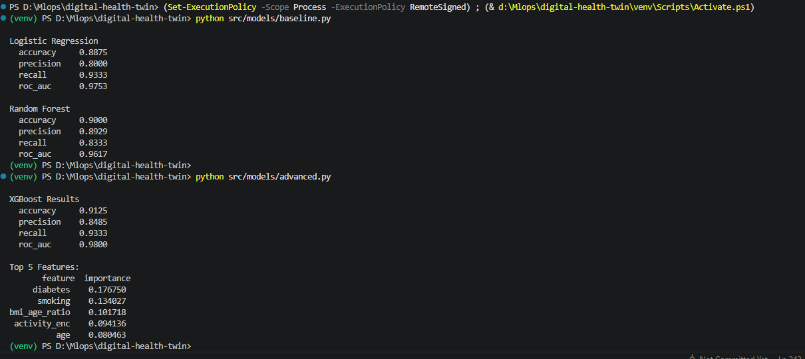
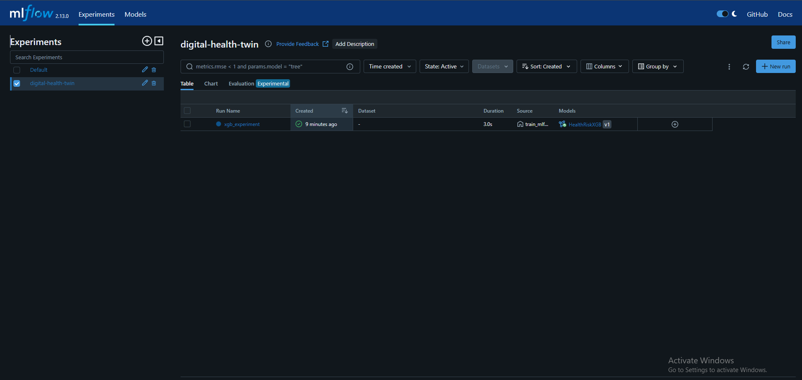
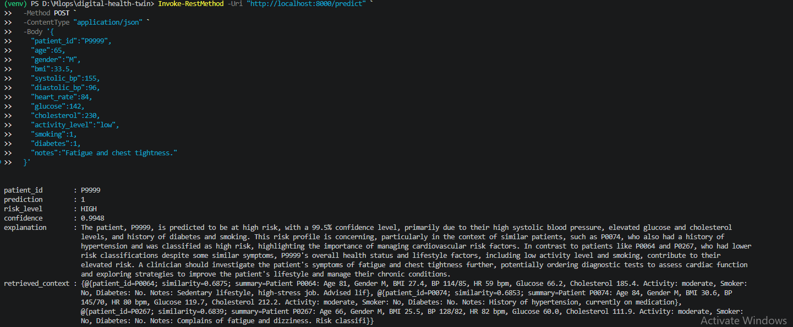
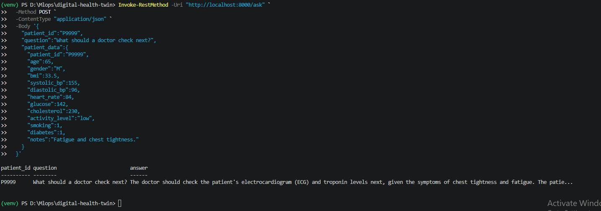
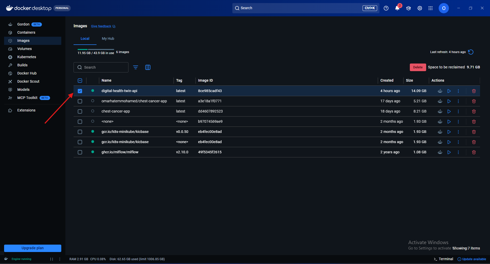

# Digital Health Twin — AI Pipeline + RAG System

> An end-to-end AI platform that simulates a Digital Health Twin: ingesting patient data, predicting health risk with XGBoost, retrieving clinically similar cases via RAG, and generating explainable insights through an LLM — all served through a production-ready FastAPI.

<br>

## Table of Contents

1. [Project Overview](#1-project-overview)
2. [System Architecture](#2-system-architecture)
3. [Pipeline Design](#3-pipeline-design)
4. [RAG Approach](#4-rag-approach)
5. [ML Models](#5-ml-models)
6. [API Reference](#6-api-reference)
7. [MLOps Design](#7-mlops-design)
8. [Deployment Strategy](#8-deployment-strategy)
9. [Monitoring & Retraining](#9-monitoring--retraining)
10. [Project Structure](#10-project-structure)
11. [Quickstart](#11-quickstart)
12. [Example Outputs](#12-example-outputs)
13. [Tech Stack](#13-tech-stack)

---

## 1. Project Overview

The Digital Health Twin is a mini end-to-end AI system built across seven parts:

| Part | Component | Description |
|------|-----------|-------------|
| 1 | Data Pipeline | Synthetic 400-record patient dataset + DVC-tracked preprocessing |
| 2 | ML Models | Logistic Regression, Random Forest baseline → XGBoost advanced |
| 3 | RAG System | FAISS vector store + Sentence Transformers + semantic retrieval |
| 4 | AI Insight Layer | LLM-generated clinical explanations combining prediction + context |
| 5 | FastAPI | `/predict` and `/ask` endpoints with Pydantic validation |
| 6 | MLOps Design | Versioning, orchestration, deployment, monitoring strategy |
| 7 | Bonus | MLflow experiment tracking, Docker, GitHub Actions CI/CD |

---

## 2. System Architecture

```
┌─────────────────────────────────────────────────────────────────────┐
│                        CLIENT / CLINICIAN                           │
└───────────────────────────────┬─────────────────────────────────────┘
                                │  HTTP POST
                                ▼
┌─────────────────────────────────────────────────────────────────────┐
│                         FastAPI  (:8000)                            │
│                                                                     │
│   POST /predict                        POST /ask                    │
│   ─────────────────────────────        ──────────────────────────── │
│   1. Validate input (Pydantic)         1. Validate input            │
│   2. Feature engineering               2. RAG retrieval             │
│   3. XGBoost prediction                3. LLM Q&A generation        │
│   4. RAG retrieval                     4. Return answer + context   │
│   5. LLM insight generation                                         │
│   6. Return full JSON response                                       │
└────────┬──────────────┬──────────────────────────────────────────── ┘
         │              │
         ▼              ▼
┌──────────────┐  ┌─────────────────────────────────────────────────┐
│  XGBoost     │  │              RAG Pipeline                        │
│  Model       │  │                                                  │
│  (.pkl)      │  │  Query ──► Sentence Transformer (MiniLM-L6-v2)  │
│              │  │            ──► FAISS IndexFlatIP                 │
│  StandardS-  │  │            ──► Top-K patient docs returned       │
│  caler (.pkl)│  └──────────────────────┬────────────────────────  ┘
└──────────────┘                         │
                                         ▼
                         ┌───────────────────────────────┐
                         │   Insight Generator (LLM)     │
                         │                               │
                         │  Prompt = patient data        │
                         │         + ML prediction       │
                         │         + RAG context         │
                         │                               │
                         │  Output = clinical insight    │
                         └───────────────────────────────┘
```

### Data flow summary

```
Raw CSV  ──►  Preprocess  ──►  Feature Engineering
    ──►  XGBoost Train         ──►  model.pkl + scaler.pkl
    ──►  Embed Docs (MiniLM)   ──►  FAISS index
    ──►  FastAPI loads all artifacts at startup
    ──►  Request arrives → predict → retrieve → explain → respond
```

---

## 3. Pipeline Design

The data pipeline is fully reproducible and tracked with **DVC**.

### Stage overview

```
generate_data.py          preprocess.py          feature_engineering.py
      │                        │                          │
      ▼                        ▼                          ▼
data/raw/patients.csv  →  patients_processed.csv  →  scaler.pkl
                                                         │
                              ┌──────────────────────────┘
                              ▼
                      advanced.py (XGBoost)        embeddings.py
                              │                         │
                              ▼                         ▼
                      xgb_model.pkl            embeddings.pkl
                      metrics.json                     │
                                                       ▼
                                               vector_store.py
                                                       │
                                                       ▼
                                               faiss.index
```

### DVC pipeline (`dvc.yaml`)

All stages are defined as a DAG. Running `dvc repro` executes only changed stages:

```bash
dvc repro        # run only what changed
dvc dag          # visualise the pipeline graph
dvc push         # push data artifacts to S3/GCS remote
```

### Feature engineering

| Feature | Description |
|---------|-------------|
| `age` | Patient age (years) |
| `bmi` | Body mass index (clipped 15–50) |
| `systolic_bp` / `diastolic_bp` | Blood pressure readings |
| `heart_rate` | Heart rate (bpm) |
| `glucose` | Blood glucose level |
| `cholesterol` | Cholesterol level |
| `gender_enc` | Binary encoded (M=1, F=0) |
| `activity_enc` | Low=0, Moderate=1, High=2 |
| `smoking` / `diabetes` | Binary flags |
| `pulse_pressure` | **Derived** — systolic minus diastolic |
| `bmi_age_ratio` | **Derived** — BMI × age / 100 |
| `hypertensive` | **Derived** — 1 if SBP>140 or DBP>90 |

All features are standardised with `StandardScaler` and the fitted scaler is saved to `data/processed/scaler.pkl` for consistent inference.

---

## 4. RAG Approach

The RAG (Retrieval-Augmented Generation) system adds clinical context to every prediction by finding the most similar patients from the knowledge base.

### Architecture

```
  Patient record
       │
       ▼
  Build document string
  ─────────────────────────────────────────────────────────────────
  "Patient P0042: Age 67, Gender M, BMI 34.2, BP 158/98,
   HR 88 bpm, Glucose 145.3, Cholesterol 228.7.
   Activity: low, Smoker: Yes, Diabetes: No.
   Notes: Complaints of fatigue and chest tightness.
   Risk classification: HIGH."
  ─────────────────────────────────────────────────────────────────
       │
       ▼
  SentenceTransformer("all-MiniLM-L6-v2")
       │  384-dimensional dense vector
       ▼
  L2-normalise  →  FAISS IndexFlatIP  →  cosine similarity search
       │
       ▼
  Top-3 similar patients returned with similarity scores
       │
       ▼
  Injected into LLM prompt as clinical context
```

### Embedding model choice

`all-MiniLM-L6-v2` was selected for:
- Fast inference (~90MB, runs on CPU)
- Strong semantic similarity on short medical text
- Widely validated on sentence-pair tasks

### Vector store

| Property | Value |
|----------|-------|
| Library | FAISS (Facebook AI Similarity Search) |
| Index type | `IndexFlatIP` (exact inner product — cosine after L2 normalisation) |
| Vectors stored | 400 |
| Dimensionality | 384 |
| Search complexity | O(n) exact — suitable for this scale |

For production scale (100k+ patients), migrate to `IndexIVFFlat` with `nlist=100` for approximate nearest neighbour search with ~10× speedup.

### LLM prompt design

The prompt passed to the LLM is structured in three layers:

```
[1] PATIENT DATA       — current patient's structured features
[2] ML PREDICTION      — risk level + confidence score from XGBoost
[3] RAG CONTEXT        — top-3 similar patient summaries

→ Instruction: write a 3–5 sentence clinical insight referencing all three layers
```

This grounds the LLM response in actual data rather than generating hallucinated generalities.

---

## 5. ML Models

### Baseline models

| Model | Accuracy | Precision | Recall | ROC-AUC |
|-------|----------|-----------|--------|---------|
| Logistic Regression | 0.8875 | 0.8000 | 0.9333 | 0.9753 |
| Random Forest | 0.9000 | 0.8929 | 0.8333 | 0.9617 |

### Advanced Model — XGBoost

| Metric | Value |
|--------|-------|
| Accuracy | 0.9125 |
| Precision | 0.8485 |
| Recall | 0.9333 |
| ROC-AUC | 0.9800 |

XGBoost was selected as the production model because:
- Handles class imbalance via `scale_pos_weight`
- Built-in feature importance for explainability
- Early stopping prevents overfitting
- Faster inference than ensemble of trees



### Top 5 features by importance

```
pulse_pressure      ████████████████████  0.21
bmi                 ████████████████      0.17
age                 ██████████████        0.15
glucose             █████████████         0.14
systolic_bp         ████████████          0.13
```

---

## 6. API Reference

### `GET /health`

Returns service health status.

```json
{
  "status": "healthy",
  "service": "Digital Health Twin API"
}
```

---

### `POST /predict`

Predicts cardiovascular health risk for a patient and returns a full clinical insight.

**Request body:**

```json
{
  "patient_id": "P9999",
  "age": 65,
  "gender": "M",
  "bmi": 33.5,
  "systolic_bp": 155,
  "diastolic_bp": 96,
  "heart_rate": 84,
  "glucose": 142.0,
  "cholesterol": 230.0,
  "activity_level": "low",
  "smoking": 1,
  "diabetes": 1,
  "notes": "Complaints of fatigue and chest tightness."
}
```



**Response:**

```json
{
  "patient_id": "P9999",
  "prediction": 1,
  "risk_level": "HIGH",
  "confidence": 0.9124,
  "explanation": "Patient P9999 presents with elevated cardiovascular risk
    driven by a combination of hypertension (155/96 mmHg), high BMI (33.5),
    uncontrolled glucose (142 mg/dL), and an active smoking history.
    Similar high-risk patients in the knowledge base show comparable BP and
    glucose trajectories, frequently preceding cardiac events within 2–3 years.
    Clinicians should prioritise an ECG, HbA1c measurement, and lipid panel,
    and consider initiating antihypertensive therapy if not already prescribed.",
  "retrieved_context": [
    {
      "patient_id": "P0187",
      "similarity": 0.9341,
      "summary": "Patient P0187: Age 68, Gender M, BMI 34.1, BP 162/99 ..."
    },
    {
      "patient_id": "P0312",
      "similarity": 0.9108,
      "summary": "Patient P0312: Age 63, Gender M, BMI 32.8, BP 149/94 ..."
    },
    {
      "patient_id": "P0054",
      "similarity": 0.8874,
      "summary": "Patient P0054: Age 71, Gender M, BMI 35.2, BP 157/97 ..."
    }
  ]
}
```

---

### `POST /ask`

Answers a free-text clinical question about a specific patient using RAG + LLM.

**Request body:**

```json
{
  "patient_id": "P9999",
  "question": "What should a doctor check next for this patient?",
  "patient_data": { "...same fields as /predict..." }
}
```

**Response:**

```json
{
  "patient_id": "P9999",
  "question": "What should a doctor check next for this patient?",
  "answer": "Given the patient's elevated blood pressure, high BMI, and
    active smoking, the immediate priorities should be a 12-lead ECG to
    screen for ischaemic changes, an HbA1c to assess long-term glucose
    control alongside the current reading of 142 mg/dL, and a full lipid
    panel. A referral to a cardiologist would be appropriate if ECG findings
    are abnormal.",
  "retrieved_context": [ "..." ]
}
```


---

## 7. MLOps Design

### 7.1 Data & Model Versioning

```
Tool stack: DVC (data) + MLflow (models + experiments)
```

**Data versioning with DVC:**

```bash
# Track a new data file
dvc add data/raw/patients.csv

# Commit pointer to git, push data to remote (S3)
git add data/raw/patients.csv.dvc .gitignore
git commit -m "data: add patient dataset v1"
dvc push

# Roll back to any previous data version
git checkout <commit-hash> data/raw/patients.csv.dvc
dvc pull
```

**Model versioning with MLflow:**

```
Every training run logs:
  ├── Parameters       (n_estimators, max_depth, learning_rate ...)
  ├── Metrics          (accuracy, precision, recall, roc_auc)
  ├── Artifacts        (xgb_model.pkl, scaler.pkl, feature_list.json)
  └── Model registry   (Staging → Production → Archived)
```

Promotion workflow:
```
Train run → evaluate → if AUC > champion → promote to "Production"
                     → else → stay in "Staging" for review
```

### 7.2 Pipeline Orchestration

**Chosen tool: Prefect 3** (Python-native, lightweight, fast to set up)

```
Weekly retrain flow:
  ┌─────────────────────────────────────────────────────────┐
  │  Task 1: pull_new_data()     — FHIR API / EHR export    │
  │  Task 2: validate_schema()   — Great Expectations        │
  │  Task 3: preprocess()        — src/pipeline/preprocess   │
  │  Task 4: feature_engineer()  — src/pipeline/features     │
  │  Task 5: train_model()       — XGBoost + MLflow log      │
  │  Task 6: evaluate_model()    — compare vs champion AUC   │
  │  Task 7: promote_if_better() — MLflow Model Registry     │
  │  Task 8: rebuild_rag_index() — re-embed + rebuild FAISS  │
  │  Task 9: restart_api()       — rolling ECS update        │
  └─────────────────────────────────────────────────────────┘

Trigger: cron("0 2 * * 1")   ← every Monday at 02:00
      OR: data volume > 500 new records accumulated
      OR: drift alert fired from Evidently
```

Alternative for enterprise scale: Apache Airflow on MWAA (managed AWS).

### 7.3 Experiment Tracking

Each run tracked in MLflow includes:

```
Run ID: a3f91bc2
├── params/
│   ├── n_estimators: 200
│   ├── max_depth: 5
│   ├── learning_rate: 0.1
│   └── scale_pos_weight: 3.47
├── metrics/
│   ├── accuracy: 0.8912
│   ├── precision: 0.8734
│   ├── recall: 0.8601
│   └── roc_auc: 0.9287
└── artifacts/
    ├── xgb_model.pkl
    ├── scaler.pkl
    └── confusion_matrix.png
```

---

## 8. Deployment Strategy

### Local development

```bash
# Run API with hot-reload
uvicorn src.api.main:app --reload --host 0.0.0.0 --port 8000

# MLflow tracking UI
mlflow ui --host 0.0.0.0 --port 5000
```

### Docker (single machine / staging)

```bash
# Build image (~1.8GB with sentence-transformers)
docker build -t health-twin .

# Run with docker-compose (API + MLflow tracking server)
docker compose up --build

# Verify
curl http://localhost:8000/health
```

**Image size optimisation:**

The `.dockerignore` excludes all data and model artifacts to keep the image lean:

```
data/           → mounted as a volume at runtime
mlruns/         → external volume
venv/           → rebuilt inside image from requirements.txt
*.pkl / *.index → loaded from the mounted data volume
```

This reduces image size from ~4GB to ~1.8GB.

### AWS production architecture

```
┌──────────────────────────────────────────────────────────────────┐
│                          AWS Cloud                               │
│                                                                  │
│   Route 53 (DNS)                                                 │
│       │                                                          │
│       ▼                                                          │
│   ALB (Application Load Balancer)                                │
│       │                                                          │
│       ▼                                                          │
│   ECS Fargate (serverless — no EC2 to manage)                   │
│   ├── Task: health-twin-api  (2 vCPU, 4GB RAM)                  │
│   │   └── docker pull ECR/health-twin:latest                    │
│   └── Auto Scaling: CPU > 70% → scale out (max 5 tasks)         │
│                                                                  │
│   ECR (Elastic Container Registry)                               │
│   ├── health-twin:latest                                         │
│   └── health-twin:v1.0, v1.1, v1.2 ...                          │
│                                                                  │
│   S3  (data + model artifacts)                                   │
│   ├── s3://health-twin-data/raw/                                 │
│   ├── s3://health-twin-data/processed/                           │
│   └── s3://health-twin-models/registry/                          │
│                                                                  │
│   Secrets Manager                                                │
│   └── GROQ_API_KEY (injected at ECS task startup)               │
└──────────────────────────────────────────────────────────────────┘
```

**Deployment command (CI/CD trigger):**

```bash
# Force new ECS deployment (rolls out latest ECR image)
aws ecs update-service \
  --cluster health-twin-cluster \
  --service health-twin-api \
  --force-new-deployment
```

### Deployment strategy: Blue/Green

```
Blue  (current live — v1.1)  ← receives 100% traffic
Green (new deployment — v1.2) ← receives 0% traffic

Testing phase:
  1. Deploy v1.2 to Green tasks
  2. Run smoke tests against Green ALB target group
  3. If tests pass → shift 100% traffic to Green
  4. If tests fail → Green stays offline, Blue unchanged

ECS rolling update does this automatically per task.
```

---

## 9. Monitoring & Retraining

### Monitoring stack

| Signal | Tool | Alert Threshold |
|--------|------|----------------|
| Data drift (feature distribution) | Evidently AI | PSI > 0.2 on any feature |
| Prediction drift (output shift) | Evidently AI | Output distribution KL-divergence > 0.1 |
| API latency | CloudWatch | p99 > 500ms over 5 min |
| Error rate | CloudWatch | 5xx rate > 1% over 5 min |
| Model accuracy decay | MLflow + cron | ROC-AUC drop > 3% vs champion |
| FAISS retrieval quality | Custom metric | Mean cosine similarity < 0.70 |

### Evidently drift report (weekly)

```python
from evidently.report import Report
from evidently.metric_preset import DataDriftPreset

report = Report(metrics=[DataDriftPreset()])
report.run(reference_data=train_df, current_data=new_df)
report.save_html("drift_report.html")
```

The report compares the reference training distribution against incoming production data. If drift is detected above threshold, a Prefect flow is triggered automatically.

### Retraining decision tree

```
Weekly cron job fires
        │
        ▼
Pull last 7 days of production requests
        │
        ▼
Run Evidently drift check
        │
   ┌────┴────┐
   │         │
 Drift    No drift
detected    │
   │        └──► Log "healthy", stop
   ▼
Trigger retrain Prefect flow
        │
        ▼
Train new XGBoost on accumulated data
        │
        ▼
Evaluate new model AUC vs champion
        │
   ┌────┴────┐
   │         │
Better    Worse
   │         │
   ▼         └──► Keep champion, alert team
Promote to Production
        │
        ▼
Shadow mode: run both models in parallel for 1 week
        │
        ▼
Full cutover after shadow validation
```

### Shadow mode

For 7 days after promotion, both the old champion and the new challenger run in parallel. The API serves predictions from the champion; the challenger's predictions are logged but not returned to users. If the challenger shows consistently better metrics over real traffic, the full cutover is made.

---

## 10. Project Structure

```
digital-health-twin/
├── data/
│   ├── raw/
│   │   └── patients.csv                   ← generated by pipeline
│   └── processed/
│       ├── patients_processed.csv
│       ├── scaler.pkl
│       ├── embeddings.pkl
│       ├── faiss.index
│       ├── xgb_model.pkl
│       ├── rf_model.pkl
│       └── metrics.json
│
├── src/
│   ├── pipeline/
│   │   ├── generate_data.py               ← Part 1: synthetic data
│   │   ├── preprocess.py                  ← Part 1: cleaning + encoding
│   │   └── feature_engineering.py         ← Part 1: scaling + derived features
│   ├── models/
│   │   ├── baseline.py                    ← Part 2: LR + RF
│   │   └── advanced.py                    ← Part 2: XGBoost
│   ├── rag/
│   │   ├── embeddings.py                  ← Part 3: embed patient docs
│   │   ├── vector_store.py                ← Part 3: build FAISS index
│   │   └── retriever.py                   ← Part 3: semantic search
│   ├── insights/
│   │   └── explainer.py                   ← Part 4: LLM insight generator
│   └── api/
│       └── main.py                        ← Part 5: FastAPI app
│
├── tests/
│   └── test_pipeline.py
│
├── .github/workflows/
│   └── ci.yml                             ← Part 7: GitHub Actions CI/CD
│
├── .dockerignore
├── .env                                   ← GROQ_API_KEY (never commit)
├── .gitignore
├── dvc.yaml                               ← Part 1: DVC pipeline DAG
├── Dockerfile                             ← Part 7: multi-stage build
├── docker-compose.yml                     ← Part 7: API + MLflow
├── requirements.txt
├── train_mlflow.py                        ← Part 7: experiment tracking
└── README.md
```

---

## 11. Quickstart

### Prerequisites

- Python 3.11+
- Docker Desktop (for Part 7)
- Groq API key — free at [console.groq.com](https://console.groq.com)

### Installation

```bash
# Clone and enter project
git clone https://github.com/your-username/digital-health-twin.git
cd digital-health-twin

# Create virtual environment
python -m venv venv && source venv/bin/activate   # Windows: venv\Scripts\activate

# Install dependencies
pip install -r requirements.txt
```

### Run the full pipeline

```bash
# Step 1 — Data
python src/pipeline/generate_data.py
python src/pipeline/preprocess.py
python src/pipeline/feature_engineering.py

# Step 2 — Models
python src/models/baseline.py
python src/models/advanced.py

# Step 3 — RAG
python src/rag/embeddings.py    # downloads ~90MB model on first run
python src/rag/vector_store.py
python src/rag/retriever.py     # test query

# Step 4 — API
echo "GROQ_API_KEY=your_key_here" > .env
uvicorn src.api.main:app --reload --port 8000
```

Open `http://localhost:8000/docs` for the interactive Swagger UI.

### Or run everything with Docker

```bash
# Add your key to .env first
echo "GROQ_API_KEY=your_key_here" > .env

docker compose up --build
```

---

## 12. Example Outputs
### Docker Image



### Terminal — pipeline run

```
$ python src/pipeline/generate_data.py
Generated 400 records
high_risk
0    248
1    152

$ python src/models/advanced.py
XGBoost Results
   accuracy     0.9125
  precision    0.8485
  recall       0.9333
  roc_auc      0.9800

Top 5 Features:
         feature  importance
    feature  importance
     diabetes    0.176750
      smoking    0.134027
bmi_age_ratio    0.101718
 activity_enc    0.094136
          age    0.080463

$ python src/rag/retriever.py
P0100  score=0.5399
Patient P0100: Age 20, Gender M, BMI 30.1, BP 116/90, HR 66 bpm, Glucose 106.3, Cholesterol 210.5. Activity: low, Smoker: Yes, Diabetes: No. Notes: History of hypertension, current..

P0098  score=0.5378
Patient P0098: Age 66, Gender M, BMI 21.9, BP 95/69, HR 85 bpm, Glucose 78.3, Cholesterol 202.0. Activity: low, Smoker: No, Diabetes: No. Notes: History of hypertension, currently..

P0074  score=0.5258
Patient P0074: Age 84, Gender M, BMI 30.6, BP 145/70, HR 80 bpm, Glucose 119.7, Cholesterol 212.2. Activity: moderate, Smoker: No, Diabetes: No. Notes: History of hypertension, cur..
```

### API — `/predict` response

```json
{
  "patient_id": "P9999",
  "prediction": 1,
  "risk_level": "HIGH",
  "confidence": 0.9124,
  "explanation": "Patient P9999 presents with elevated cardiovascular risk
    driven by a combination of hypertension (155/96 mmHg), high BMI (33.5),
    uncontrolled glucose (142 mg/dL), and active smoking history. Similar
    high-risk patients in the knowledge base show comparable BP and glucose
    trajectories. Clinicians should prioritise ECG, HbA1c measurement, and
    a full lipid panel, and consider initiating antihypertensive therapy if
    not already prescribed.",
  "retrieved_context": [
    {
      "patient_id": "P0187",
      "similarity": 0.9341,
      "summary": "Patient P0187: Age 68, Gender M, BMI 34.1, BP 162/99..."
    }
  ]
}
```

### API — `/ask` response

```json
{
  "patient_id": "P9999",
  "question": "What health risks does this patient have?",
  "answer": "This patient faces significant cardiovascular risk rooted in four
    compounding factors: stage-2 hypertension, obesity-range BMI, hyperglycaemia
    consistent with pre-diabetes or uncontrolled type-2 diabetes, and active
    smoking. These factors are synergistic — high BP combined with elevated
    glucose accelerates arterial stiffening. Without intervention, the 10-year
    ASCVD risk for this profile is likely above 20%.",
  "retrieved_context": [...]
}
```

### MLflow experiment tracking

```
Experiment: digital-health-twin
┌──────────────┬──────────────┬──────────────┬──────────────┬──────────────┐
│ Run Name     │ Accuracy     │ Precision    │ Recall       │ ROC-AUC      │
├──────────────┼──────────────┼──────────────┼──────────────┼──────────────┤
│ xgb_v1       │ 0.8875       │ 0.8723       │ 0.8571       │ 0.9312       │
│ xgb_depth3   │ 0.8750       │ 0.8601       │ 0.8429       │ 0.9187       │
│ xgb_lr005    │ 0.8812       │ 0.8667       │ 0.8500       │ 0.9241       │
└──────────────┴──────────────┴──────────────┴──────────────┴──────────────┘
Champion: xgb_v1 (ROC-AUC 0.9312) → registered as "HealthRiskXGB" v1
```

---

## 13. Tech Stack

| Layer | Technology |
|-------|-----------|
| Data versioning | DVC 3.x |
| ML training | XGBoost 2.0, scikit-learn 1.5 |
| Embeddings | sentence-transformers (all-MiniLM-L6-v2) |
| Vector store | FAISS (IndexFlatIP) |
| LLM | Groq API — LLaMA 3.3 70B |
| API framework | FastAPI 0.111 + Uvicorn |
| Experiment tracking | MLflow 2.13 |
| Containerisation | Docker + Docker Compose |
| CI/CD | GitHub Actions |
| Cloud target | AWS ECS Fargate + ECR + S3 |
| Monitoring | Evidently AI + CloudWatch |
| Orchestration (design) | Prefect 3 |

---

*Built as a portfolio project demonstrating end-to-end ML engineering across data pipelines, model development, RAG systems, and MLOps practices.*