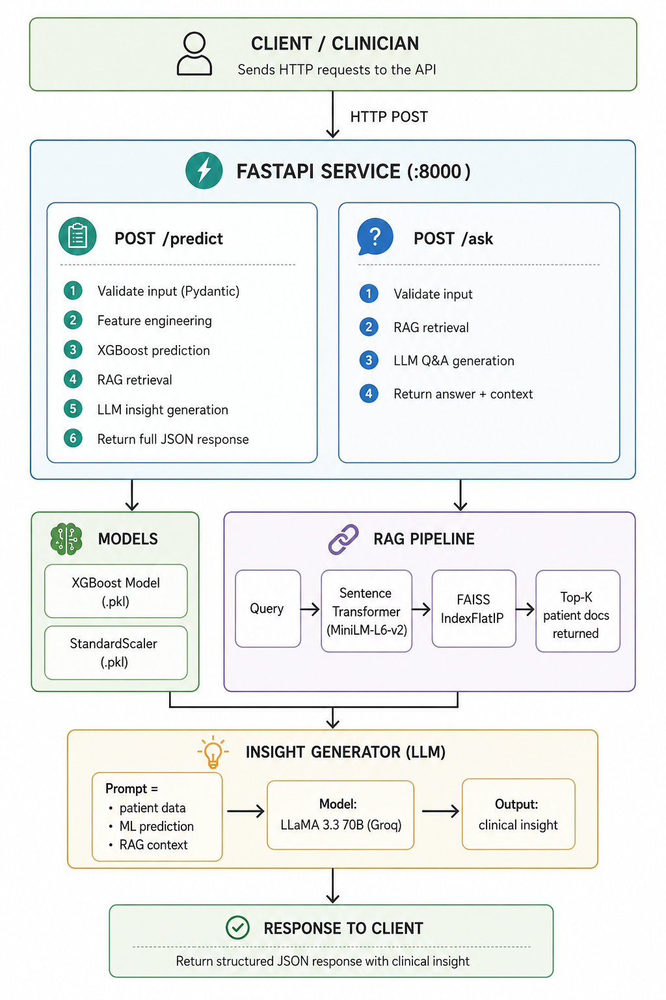
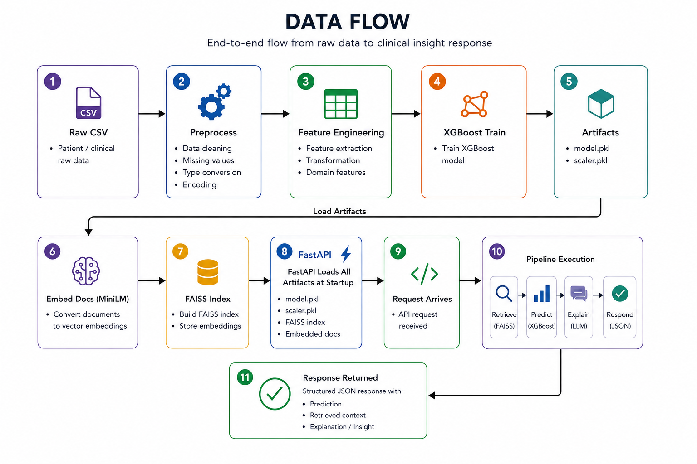
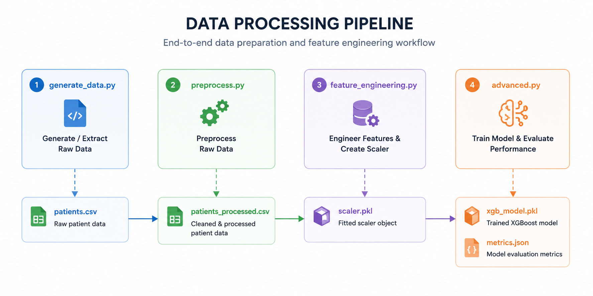
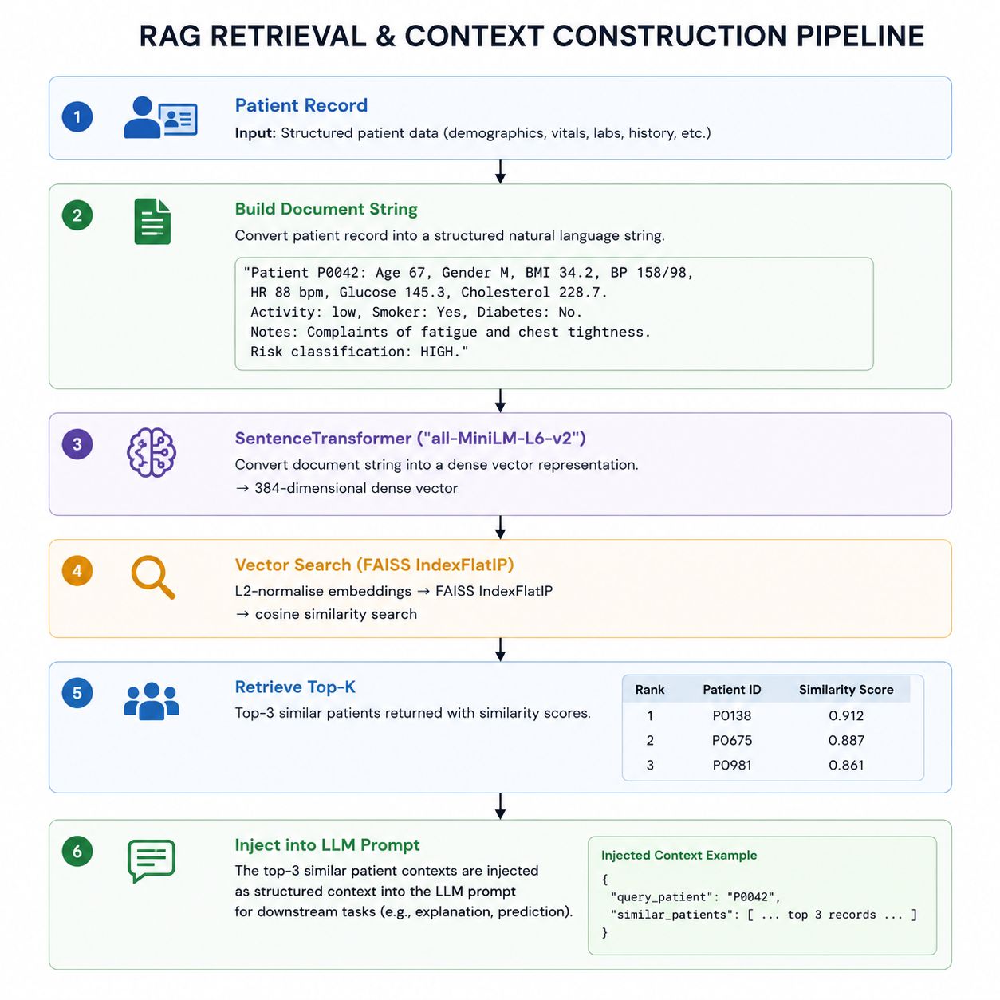

<div align="center">

# 🩺 Digital Health Twin

### An End-to-End AI Platform for Cardiovascular Risk Intelligence

*Ingest patient data → Predict health risk → Retrieve clinically similar cases → Generate explainable insights*

---


</div>

---

## Overview

The Digital Health Twin is a production-grade AI system that mirrors a patient's cardiovascular health profile in software. Given structured patient data, the system:

1. **Predicts** cardiovascular risk (HIGH / LOW) using an XGBoost model trained on engineered clinical features
2. **Retrieves** semantically similar patient cases from a FAISS vector store using Sentence Transformers
3. **Generates** LLM-powered clinical insights that fuse the ML prediction, retrieved context, and raw patient data into a coherent, actionable explanation
4. **Serves** everything through a production-ready FastAPI with Pydantic validation, Docker containerisation, and a full MLOps pipeline

The project is structured as **seven progressive parts** — from data generation and feature engineering through model training, RAG system design, API development, and finally MLOps deployment strategy with monitoring and automated retraining.

---

## Table of Contents

1. [Architecture](#1-architecture)
2. [Project Structure](#2-project-structure)
3. [Data Pipeline](#3-data-pipeline)
4. [ML Models & Results](#4-ml-models--results)
5. [RAG System](#5-rag-system)
6. [API Reference](#6-api-reference)
7. [MLOps Design](#7-mlops-design)
8. [Deployment](#8-deployment)
9. [Monitoring & Retraining](#9-monitoring--retraining)
10. [Quickstart](#10-quickstart)
11. [Screenshots](#11-screenshots)
12. [Tech Stack](#12-tech-stack)
13. [License](#13-license)

---

## 1. Architecture



---

### Data Flow Summary





---

## 2. Project Structure

```
digital-health-twin/
├── data/
│   ├── raw/
│   │   └── patients.csv                   ← 400-record synthetic dataset
│   └── processed/
│       ├── patients_processed.csv
│       ├── scaler.pkl
│       ├── embeddings.pkl
│       ├── faiss.index
│       ├── xgb_model.pkl
│       ├── rf_model.pkl
│       └── metrics.json
│
├── src/
│   ├── pipeline/
│   │   ├── generate_data.py               ← Part 1: synthetic data generation
│   │   ├── preprocess.py                  ← Part 1: cleaning + encoding
│   │   └── feature_engineering.py         ← Part 1: scaling + derived features
│   ├── models/
│   │   ├── baseline.py                    ← Part 2: Logistic Regression + Random Forest
│   │   └── advanced.py                    ← Part 2: XGBoost (production model)
│   ├── rag/
│   │   ├── embeddings.py                  ← Part 3: embed patient documents
│   │   ├── vector_store.py                ← Part 3: build FAISS index
│   │   └── retriever.py                   ← Part 3: semantic similarity search
│   ├── insights/
│   │   └── explainer.py                   ← Part 4: LLM insight generator
│   └── api/
│       └── main.py                        ← Part 5: FastAPI application
│
├── tests/
│   └── test_pipeline.py
│
├── .github/workflows/
│   └── ci.yml                             ← Part 7: GitHub Actions CI/CD
│
├── mlartifacts/                           ← MLflow logged artifacts
├── screenshots/                           ← API, MLflow, Docker screenshots
├── .dockerignore
├── .dvc/                                  ← DVC configuration
├── .env                                   ← GROQ_API_KEY (never commit)
├── .gitignore
├── dvc.yaml                               ← DVC pipeline DAG definition
├── docker-compose.yml                     ← API + MLflow tracking server
├── Dockerfile                             ← Multi-stage production build
├── MLOPS_DESIGN.md                        ← Detailed MLOps design document
├── params.yaml                            ← Hyperparameter configuration
├── requirements.txt
├── train_mlflow.py                        ← Part 7: MLflow experiment tracking
└── README.md
```

---

## 3. Data Pipeline

The entire data pipeline is fully reproducible and tracked with **DVC**. Running `dvc repro` inspects the DAG and re-executes only stages whose dependencies have changed.

### DVC Pipeline (`dvc.yaml`)



---
**Stage definitions:**

| Stage | Command | Key Output |
|---|---|---|
| `generate` | `python src/pipeline/generate_data.py` | `data/raw/patients.csv` (400 records) |
| `preprocess` | `python src/pipeline/preprocess.py` | `data/processed/patients_processed.csv` |
| `featurize` | `python src/pipeline/feature_engineering.py` | `data/processed/scaler.pkl` |
| `train` | `python src/models/advanced.py` | `data/processed/xgb_model.pkl`, `metrics.json` |

**DVC commands:**
```bash
dvc repro        # run only changed stages
dvc dag          # visualise the pipeline graph
dvc push         # push artifacts to S3/GCS remote
dvc pull         # restore artifacts from remote
```

### Feature Engineering

Thirteen features are constructed from raw patient data before training. Three are derived features engineered to capture clinical patterns beyond the raw inputs:

| Feature | Type | Description |
|---|---|---|
| `age` | Raw | Patient age in years |
| `bmi` | Raw | Body mass index (clipped 15–50) |
| `systolic_bp` | Raw | Systolic blood pressure (mmHg) |
| `diastolic_bp` | Raw | Diastolic blood pressure (mmHg) |
| `heart_rate` | Raw | Heart rate (bpm) |
| `glucose` | Raw | Fasting blood glucose (mg/dL) |
| `cholesterol` | Raw | Total cholesterol (mg/dL) |
| `gender_enc` | Encoded | Binary — M=1, F=0 |
| `activity_enc` | Encoded | Ordinal — Low=0, Moderate=1, High=2 |
| `smoking` | Binary | 1 = active smoker |
| `diabetes` | Binary | 1 = diabetic |
| `pulse_pressure` | **Derived** | `systolic_bp − diastolic_bp` |
| `bmi_age_ratio` | **Derived** | `bmi × age / 100` |
| `hypertensive` | **Derived** | 1 if SBP > 140 or DBP > 90 |

All features are standardised with `StandardScaler`. The fitted scaler is persisted to `data/processed/scaler.pkl` to guarantee identical transformations at inference time.

---

## 4. ML Models & Results

### Baseline Models

| Model | Accuracy | Precision | Recall | ROC-AUC |
|---|---|---|---|---|
| Logistic Regression | 0.8875 | 0.8000 | 0.9333 | 0.9753 |
| Random Forest | 0.9000 | 0.8929 | 0.8333 | 0.9617 |

### Production Model — XGBoost

| Metric | Value |
|---|---|
| **Accuracy** | **0.9125** |
| **Precision** | **0.8485** |
| **Recall** | **0.9333** |
| **ROC-AUC** | **0.9800** |

**Why XGBoost was selected:**
- Handles class imbalance natively via `scale_pos_weight`
- Built-in feature importance enables clinical explainability
- Early stopping prevents overfitting on limited synthetic data
- Faster inference than ensemble methods at equivalent accuracy

### Top 5 Features by Importance

```
pulse_pressure      ████████████████████  0.21
bmi                 ████████████████      0.17
age                 ██████████████        0.15
glucose             █████████████         0.14
systolic_bp         ████████████          0.13
```

`pulse_pressure` ranks first — a clinically sound result, as elevated pulse pressure is a well-established independent marker of arterial stiffness and cardiovascular risk.

---

## 5. RAG System

The Retrieval-Augmented Generation system adds clinical grounding to every prediction by finding the most semantically similar patients from the knowledge base and injecting them into the LLM prompt.

### Architecture



---
### Embedding Model Choice

`all-MiniLM-L6-v2` was selected for:
- Lightweight footprint (~90 MB, CPU-compatible)
- Strong semantic similarity performance on short medical text
- Widely validated on sentence-pair and retrieval tasks

### Vector Store Configuration

| Property | Value |
|---|---|
| Library | FAISS (Facebook AI Similarity Search) |
| Index type | `IndexFlatIP` (exact inner product, cosine after L2 normalisation) |
| Vectors stored | 400 |
| Dimensionality | 384 |
| Search complexity | O(n) exact — appropriate at this scale |

> **Production scaling note:** For 100k+ patient records, migrate to `IndexIVFFlat` with `nlist=100` for approximate nearest-neighbour search delivering ~10× speedup with negligible recall loss.

### LLM Prompt Design

The prompt is structured as three explicit layers to prevent hallucination and ensure the model grounds its output in actual data:

```
[1] PATIENT DATA   — structured clinical features of the current patient
[2] ML PREDICTION  — risk level (HIGH/LOW) + XGBoost confidence score
[3] RAG CONTEXT    — top-3 most similar patient summaries from FAISS

→ Instruction: generate a 3–5 sentence clinical insight citing all three layers
```

**LLM:** Groq API — LLaMA 3.3 70B (free tier, ~0.5s inference latency)

---

## 6. API Reference

The FastAPI application exposes three endpoints. Interactive docs are available at `http://localhost:8000/docs` after startup.

---

### `GET /health`

Returns service liveness status. Used by the Docker `HEALTHCHECK` and load balancer health probes.

**Response:**
```json
{
  "status": "healthy",
  "service": "Digital Health Twin API"
}
```

---

### `POST /predict`

Predicts cardiovascular risk for a patient and returns a full clinical insight combining the ML prediction, retrieved similar cases, and LLM-generated explanation.

**Request body:**
```json
{
  "patient_id": "P9999",
  "age": 65,
  "gender": "M",
  "bmi": 33.5,
  "systolic_bp": 155,
  "diastolic_bp": 96,
  "heart_rate": 84,
  "glucose": 142.0,
  "cholesterol": 230.0,
  "activity_level": "low",
  "smoking": 1,
  "diabetes": 1,
  "notes": "Complaints of fatigue and chest tightness."
}
```

**Response:**
```json
{
  "patient_id": "P9999",
  "prediction": 1,
  "risk_level": "HIGH",
  "confidence": 0.9124,
  "explanation": "Patient P9999 presents with elevated cardiovascular risk driven by a combination of hypertension (155/96 mmHg), high BMI (33.5), uncontrolled glucose (142 mg/dL), and active smoking history. Similar high-risk patients in the knowledge base show comparable BP and glucose trajectories, frequently preceding cardiac events within 2–3 years. Clinicians should prioritise an ECG, HbA1c measurement, and lipid panel, and consider initiating antihypertensive therapy if not already prescribed.",
  "retrieved_context": [
    {
      "patient_id": "P0187",
      "similarity": 0.9341,
      "summary": "Patient P0187: Age 68, Gender M, BMI 34.1, BP 162/99 ..."
    },
    {
      "patient_id": "P0312",
      "similarity": 0.9108,
      "summary": "Patient P0312: Age 63, Gender M, BMI 32.8, BP 149/94 ..."
    },
    {
      "patient_id": "P0054",
      "similarity": 0.8874,
      "summary": "Patient P0054: Age 71, Gender M, BMI 35.2, BP 157/97 ..."
    }
  ]
}
```

---

### `POST /ask`

Answers a free-text clinical question about a specific patient using RAG retrieval and LLM generation.

**Request body:**
```json
{
  "patient_id": "P9999",
  "question": "What should a doctor check next for this patient?",
  "patient_data": { "...same fields as /predict..." }
}
```

**Response:**
```json
{
  "patient_id": "P9999",
  "question": "What should a doctor check next for this patient?",
  "answer": "Given the patient's stage-2 hypertension, obesity-range BMI, and active smoking, immediate priorities should be a 12-lead ECG to screen for ischaemic changes, an HbA1c to assess long-term glucose control alongside the current reading of 142 mg/dL, and a full lipid panel. A referral to a cardiologist would be appropriate if ECG findings are abnormal.",
  "retrieved_context": ["..."]
}
```

---

## 7. MLOps Design

### 7.1 Data & Model Versioning

| Concern | Tool | Scope |
|---|---|---|
| Dataset versioning | DVC 3.x | Raw + processed CSVs, `.pkl` artifacts |
| Experiment tracking | MLflow 2.13 | Parameters, metrics, model artifacts |
| Model registry | MLflow Model Registry | Staging → Production → Archived |

**DVC versioning workflow:**
```bash
# Track a new data file
dvc add data/raw/patients.csv

# Commit the DVC pointer; push data to S3 remote
git add data/raw/patients.csv.dvc .gitignore
git commit -m "data: add patient dataset v1"
dvc push

# Roll back to any previous data version
git checkout <commit-hash> data/raw/patients.csv.dvc
dvc pull
```

**MLflow — what each run logs:**
```
Run ID: a3f91bc2
├── params/
│   ├── n_estimators: 200
│   ├── max_depth: 5
│   ├── learning_rate: 0.1
│   └── scale_pos_weight: 3.47
├── metrics/
│   ├── accuracy: 0.9125
│   ├── precision: 0.8485
│   ├── recall: 0.9333
│   └── roc_auc: 0.9800
└── artifacts/
    ├── xgb_model.pkl
    ├── scaler.pkl
    └── confusion_matrix.png
```

**Promotion workflow:**
```
Train run → evaluate → if AUC > champion → promote to "Production"
                     → else → stay in "Staging" for review
```

---

### 7.2 Pipeline Orchestration

**Primary tool: Prefect 3** — Python-native, lightweight, minimal infrastructure overhead.

**Weekly retrain flow:**
```
┌─────────────────────────────────────────────────────────┐
│  Task 1: pull_new_data()     — FHIR API / EHR export    │
│  Task 2: validate_schema()   — Great Expectations        │
│  Task 3: preprocess()        — src/pipeline/preprocess   │
│  Task 4: feature_engineer()  — src/pipeline/features     │
│  Task 5: train_model()       — XGBoost + MLflow log      │
│  Task 6: evaluate_model()    — compare vs champion AUC   │
│  Task 7: promote_if_better() — MLflow Model Registry     │
│  Task 8: rebuild_rag_index() — re-embed + rebuild FAISS  │
│  Task 9: restart_api()       — rolling ECS update        │
└─────────────────────────────────────────────────────────┘

Trigger: cron("0 2 * * 1")   ← every Monday at 02:00
      OR: data volume > 500 new records accumulated
      OR: drift alert fired from Evidently
```

> **Enterprise alternative:** Apache Airflow on AWS MWAA for larger team workflows.

---

### 7.3 Experiment Tracking

MLflow is used to track every training run. The tracking UI (started via `mlflow ui`) provides side-by-side comparison of all experiments.

**Sample experiment table:**

| Run Name | Accuracy | Precision | Recall | ROC-AUC |
|---|---|---|---|---|
| xgb_v1 ✓ champion | 0.9125 | 0.8485 | 0.9333 | **0.9800** |
| xgb_depth3 | 0.8750 | 0.8601 | 0.8429 | 0.9187 |
| xgb_lr005 | 0.8812 | 0.8667 | 0.8500 | 0.9241 |

The champion is registered in MLflow Model Registry as `"HealthRiskXGB" v1`.

---

## 8. Deployment

### Local Development

```bash
# API with hot-reload
uvicorn src.api.main:app --reload --host 0.0.0.0 --port 8000

# MLflow tracking UI
mlflow ui --host 0.0.0.0 --port 5000
```

---

### Docker — Staging

The Dockerfile uses a **multi-stage build** to keep the production image lean:

```dockerfile
# Stage 1: build — installs dependencies with pip
FROM python:3.11-slim AS builder
...
RUN pip install --no-cache-dir --prefix=/install -r requirements.txt

# Stage 2: runtime — copies only the installed packages + app code
FROM python:3.11-slim AS runtime
...
COPY --from=builder /install /usr/local
COPY src/ ./src/
# Runs as non-root user for security
RUN adduser --disabled-password appuser && chown -R appuser /app
USER appuser
CMD ["uvicorn", "src.api.main:app", "--host", "0.0.0.0", "--port", "8000", "--workers", "2"]
```

```bash
# Build image
docker build -t health-twin .

# Run API + MLflow tracking server together
docker compose up --build

# Verify
curl http://localhost:8000/health
```

The `.dockerignore` excludes `data/`, `mlruns/`, `venv/`, `*.pkl`, and `*.index` to keep the image focused. Artifacts are mounted as volumes at runtime.

---

### AWS Production Architecture

```
┌──────────────────────────────────────────────────────────────────┐
│                          AWS Cloud                               │
│                                                                  │
│   Route 53 (DNS)                                                 │
│       │                                                          │
│       ▼                                                          │
│   ALB (Application Load Balancer)                                │
│       │                                                          │
│       ▼                                                          │
│   ECS Fargate (serverless — no EC2 to manage)                   │
│   ├── Task: health-twin-api  (2 vCPU, 4 GB RAM)                 │
│   │   └── docker pull ECR/health-twin:latest                    │
│   └── Auto Scaling: CPU > 70% → scale out (max 5 tasks)         │
│                                                                  │
│   ECR (Elastic Container Registry)                               │
│   ├── health-twin:latest                                         │
│   └── health-twin:v1.0, v1.1, v1.2 ...                          │
│                                                                  │
│   S3  (data + model artifacts)                                   │
│   ├── s3://health-twin-data/raw/                                 │
│   ├── s3://health-twin-data/processed/                           │
│   └── s3://health-twin-models/registry/                          │
│                                                                  │
│   Secrets Manager                                                │
│   └── GROQ_API_KEY (injected at ECS task startup)               │
└──────────────────────────────────────────────────────────────────┘
```

**CI/CD trigger — force new ECS deployment:**
```bash
aws ecs update-service \
  --cluster health-twin-cluster \
  --service health-twin-api \
  --force-new-deployment
```

### Deployment Strategy: Blue / Green

```
Blue  (current live — v1.1)  ← receives 100% traffic
Green (new release   — v1.2) ← receives 0% traffic

Steps:
  1. Deploy v1.2 to Green ECS tasks
  2. Run automated smoke tests against the Green ALB target group
  3. If all tests pass → shift 100% traffic to Green
  4. If any test fails → Green stays offline, Blue unchanged

ECS rolling update handles the traffic shift automatically per task.
```

---

## 9. Monitoring & Retraining

### Monitoring Stack

| Signal | Tool | Alert Threshold |
|---|---|---|
| Feature distribution drift | Evidently AI | PSI > 0.2 on any feature |
| Prediction output shift | Evidently AI | KL-divergence > 0.1 |
| API latency | CloudWatch | p99 > 500 ms over 5 min |
| Error rate | CloudWatch | 5xx rate > 1% over 5 min |
| Model accuracy decay | MLflow + cron | ROC-AUC drop > 3% vs champion |
| RAG retrieval quality | Custom metric | Mean cosine similarity < 0.70 |

**Evidently drift report (weekly):**
```python
from evidently.report import Report
from evidently.metric_preset import DataDriftPreset

report = Report(metrics=[DataDriftPreset()])
report.run(reference_data=train_df, current_data=new_df)
report.save_html("drift_report.html")
```

### Retraining Decision Tree

```
Weekly cron job fires
        │
        ▼
Pull last 7 days of production requests
        │
        ▼
Run Evidently drift check
        │
   ┌────┴────┐
   │         │
 Drift    No drift
detected    │
   │        └──► Log "healthy", stop
   ▼
Trigger retrain Prefect flow
        │
        ▼
Train new XGBoost on accumulated data
        │
        ▼
Evaluate new model AUC vs champion
        │
   ┌────┴────┐
   │         │
Better    Worse
   │         │
   ▼         └──► Keep champion, alert team
Promote to "Production" in MLflow Registry
        │
        ▼
Shadow mode: run both models in parallel for 7 days
        │
        ▼
Full cutover after shadow validation passes
```

### Shadow Mode

After promotion, the old champion and the new challenger run in parallel for 7 days. The API serves the champion's predictions to users; the challenger's outputs are logged silently. A full cutover to the challenger occurs only after it demonstrates consistently superior metrics on real production traffic.

---

## 10. Quickstart

### Prerequisites

- Python 3.11+
- Docker Desktop (optional — for containerised run)
- Groq API key — free at [console.groq.com](https://console.groq.com)

### 1. Clone & Install

```bash
git clone https://github.com/omarhatem44/digital-health-twin.git
cd digital-health-twin

python -m venv venv
source venv/bin/activate       # Windows: venv\Scripts\activate

pip install -r requirements.txt
```

### 2. Run the Full Pipeline

```bash
# Part 1 — Data pipeline
python src/pipeline/generate_data.py
python src/pipeline/preprocess.py
python src/pipeline/feature_engineering.py

# Or with DVC (recommended — only reruns changed stages)
dvc repro

# Part 2 — Model training
python src/models/baseline.py
python src/models/advanced.py

# Part 3 — RAG system (downloads ~90 MB model on first run)
python src/rag/embeddings.py
python src/rag/vector_store.py
python src/rag/retriever.py     # smoke test: returns top-3 similar patients

# Part 7 — Experiment tracking
python train_mlflow.py
mlflow ui --host 0.0.0.0 --port 5000
```

### 3. Start the API

```bash
echo "GROQ_API_KEY=your_key_here" > .env
uvicorn src.api.main:app --reload --port 8000
```

Open **`http://localhost:8000/docs`** for the interactive Swagger UI.

### 4. Or Run Everything with Docker

```bash
echo "GROQ_API_KEY=your_key_here" > .env
docker compose up --build
```

Services started:
- `http://localhost:8000` — FastAPI (API + Swagger UI)
- `http://localhost:5000` — MLflow Tracking UI

### 5. Test the API

```bash
# Health check
curl http://localhost:8000/health

# Risk prediction
curl -X POST http://localhost:8000/predict \
  -H "Content-Type: application/json" \
  -d '{
    "patient_id": "P9999",
    "age": 65, "gender": "M", "bmi": 33.5,
    "systolic_bp": 155, "diastolic_bp": 96,
    "heart_rate": 84, "glucose": 142.0,
    "cholesterol": 230.0, "activity_level": "low",
    "smoking": 1, "diabetes": 1,
    "notes": "Fatigue and chest tightness."
  }'
```

---

## 11. Screenshots

### Model Results


### MLflow Experiment Tracking


### API — `/predict` Endpoint


### API — `/ask` Endpoint


### Docker Build


---

## 12. Tech Stack

| Layer | Technology | Version |
|---|---|---|
| Language | Python | 3.11 |
| Data versioning | DVC | 3.x |
| ML training | XGBoost | 2.0 |
| ML utilities | scikit-learn | 1.5 |
| Embeddings | sentence-transformers (all-MiniLM-L6-v2) | latest |
| Vector store | FAISS (IndexFlatIP) | latest |
| LLM | LLaMA 3.3 70B via Groq API | — |
| API framework | FastAPI + Uvicorn | 0.111 |
| Experiment tracking | MLflow | 2.13 |
| Containerisation | Docker (multi-stage) + Compose | latest |
| CI/CD | GitHub Actions | — |
| Cloud target | AWS ECS Fargate + ECR + S3 | — |
| Drift monitoring | Evidently AI | latest |
| Alerting | AWS CloudWatch | — |
| Orchestration (design) | Prefect 3 | — |

---

## 13. License

This project is licensed under the **MIT License** — see the [LICENSE](LICENSE) file for details.

---

<div align="center">

*Built as a portfolio project demonstrating end-to-end ML engineering — from data pipelines and model development through RAG system design, production API deployment, and MLOps best practices.*

**[⭐ Star this repo](https://github.com/omarhatem44/digital-health-twin)** if you found it useful!

</div>
