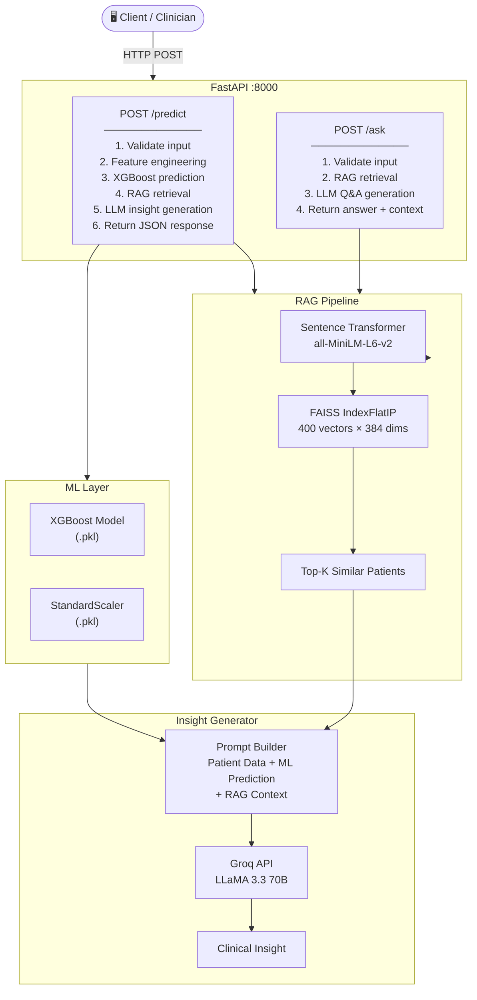
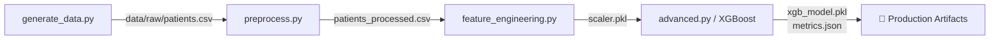
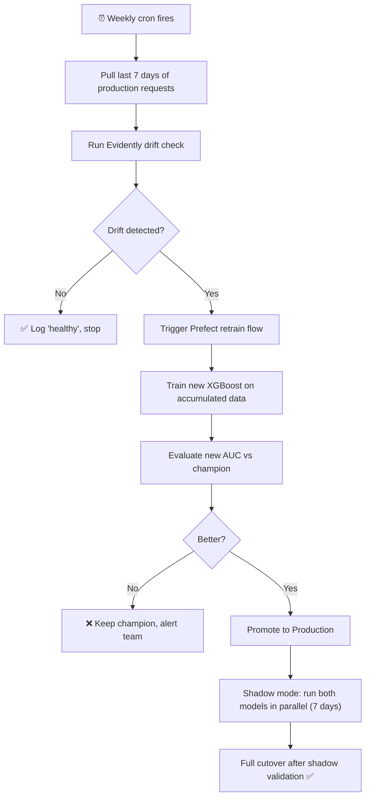

# Digital Health Twin — AI Pipeline + RAG System

<p align="center">
  
  
  
  
  
  
  
  
  
</p>

> An end-to-end AI platform that simulates a **Digital Health Twin**: ingesting synthetic patient data, predicting cardiovascular risk with XGBoost, retrieving clinically similar cases via a FAISS-powered RAG system, and generating explainable clinical insights through an LLM — all served through a production-ready FastAPI.

---

## Table of Contents

1. [Project Overview](#1-project-overview)
2. [System Architecture](#2-system-architecture)
3. [DVC Pipeline](#3-dvc-pipeline)
4. [Feature Engineering](#4-feature-engineering)
5. [RAG System](#5-rag-system)
6. [ML Models & Results](#6-ml-models--results)
7. [API Reference](#7-api-reference)
8. [MLOps Design](#8-mlops-design)
9. [Deployment Strategy](#9-deployment-strategy)
10. [Monitoring & Retraining](#10-monitoring--retraining)
11. [Project Structure](#11-project-structure)
12. [Quickstart](#12-quickstart)
13. [Tech Stack](#13-tech-stack)

---

## 1. Project Overview

The Digital Health Twin is a mini end-to-end AI system structured across seven parts:

| Part | Component | Description |
|------|-----------|-------------|
| 1 | **Data Pipeline** | Synthetic 400-record patient dataset + DVC-tracked preprocessing |
| 2 | **ML Models** | Logistic Regression & Random Forest baselines → XGBoost production model |
| 3 | **RAG System** | FAISS vector store + Sentence Transformers (MiniLM-L6-v2) for semantic retrieval |
| 4 | **AI Insight Layer** | LLM-generated clinical explanations combining prediction + retrieved context |
| 5 | **FastAPI** | `/predict` and `/ask` endpoints with Pydantic validation |
| 6 | **MLOps Design** | Versioning, orchestration, deployment, and monitoring strategy |
| 7 | **Bonus** | MLflow experiment tracking, Docker, GitHub Actions CI/CD |

---

## 2. System Architecture



### Data Flow

```
Raw CSV  →  Preprocess  →  Feature Engineering
         →  XGBoost Train         →  model.pkl + scaler.pkl
         →  Embed Docs (MiniLM)   →  FAISS index
         →  FastAPI loads all artifacts at startup
         →  Request arrives → predict → retrieve → explain → respond
```

---

## 3. DVC Pipeline

The data pipeline is fully reproducible and tracked with **DVC**. All stages form a DAG defined in `dvc.yaml`:



**DVC stages (`dvc.yaml`):**

| Stage | Command | Outputs |
|-------|---------|---------|
| `generate` | `python src/pipeline/generate_data.py` | `data/raw/patients.csv` |
| `preprocess` | `python src/pipeline/preprocess.py` | `data/processed/patients_processed.csv` |
| `featurize` | `python src/pipeline/feature_engineering.py` | `data/processed/scaler.pkl` |
| `train` | `python src/models/advanced.py` | `data/processed/xgb_model.pkl`, `metrics.json` |

```bash
dvc repro      # run only stages that changed
dvc dag        # visualise the pipeline graph
dvc push       # push data artifacts to S3/GCS remote
```

---

## 4. Feature Engineering

All features are standardised with `StandardScaler`, and the fitted scaler is saved to `data/processed/scaler.pkl` for consistent inference.

| Feature | Description |
|---------|-------------|
| `age` | Patient age (years) |
| `bmi` | Body mass index (clipped 15–50) |
| `systolic_bp` / `diastolic_bp` | Blood pressure readings |
| `heart_rate` | Heart rate (bpm) |
| `glucose` | Blood glucose level |
| `cholesterol` | Cholesterol level |
| `gender_enc` | Binary encoded (M=1, F=0) |
| `activity_enc` | Low=0, Moderate=1, High=2 |
| `smoking` / `diabetes` | Binary flags |
| `pulse_pressure` | **Derived** — systolic minus diastolic |
| `bmi_age_ratio` | **Derived** — BMI × age / 100 |
| `hypertensive` | **Derived** — 1 if SBP > 140 or DBP > 90 |

---

## 5. RAG System

The RAG (Retrieval-Augmented Generation) system adds clinical context to every prediction by finding the most similar patients from the knowledge base.

### How it works

```
Patient record
     │
     ▼
Build document string:
  "Patient P0042: Age 67, Gender M, BMI 34.2, BP 158/98, HR 88 bpm,
   Glucose 145.3, Cholesterol 228.7. Activity: low, Smoker: Yes,
   Diabetes: No. Risk classification: HIGH."
     │
     ▼
SentenceTransformer("all-MiniLM-L6-v2")  →  384-dim dense vector
     │
     ▼
L2-normalise  →  FAISS IndexFlatIP  →  cosine similarity search
     │
     ▼
Top-3 similar patients returned with similarity scores
     │
     ▼
Injected into LLM prompt as clinical context
```

### Vector Store Properties

| Property | Value |
|----------|-------|
| Library | FAISS (Facebook AI Similarity Search) |
| Index type | `IndexFlatIP` (exact inner product — cosine after L2 normalisation) |
| Vectors stored | 400 |
| Dimensionality | 384 |
| Search complexity | O(n) exact — suitable for this scale |

> **Production note:** For 100k+ patients, migrate to `IndexIVFFlat` with `nlist=100` for approximate nearest-neighbour search with ~10× speedup.

### LLM Prompt Structure

```
[1] PATIENT DATA     — current patient's structured features
[2] ML PREDICTION    — risk level + confidence score from XGBoost
[3] RAG CONTEXT      — top-3 similar patient summaries

→ Instruction: write a 3–5 sentence clinical insight referencing all three layers
```

This grounds the LLM response in actual data rather than hallucinated generalities.

---

## 6. ML Models & Results

### Baseline Models

| Model | Accuracy | Precision | Recall | ROC-AUC |
|-------|----------|-----------|--------|---------|
| Logistic Regression | 0.8875 | 0.8000 | 0.9333 | 0.9753 |
| Random Forest | 0.9000 | 0.8929 | 0.8333 | 0.9617 |

### Production Model — XGBoost ✅

| Metric | Value |
|--------|-------|
| Accuracy | **0.9125** |
| Precision | **0.8485** |
| Recall | **0.9333** |
| ROC-AUC | **0.9800** |

XGBoost was selected as the production model because it handles class imbalance via `scale_pos_weight`, provides built-in feature importance for explainability, uses early stopping to prevent overfitting, and delivers faster inference than a full tree ensemble.

|  |  |
|---|---|

### Top 5 Feature Importances

```
pulse_pressure   ████████████████████  0.21
bmi              ████████████████      0.17
age              ██████████████        0.15
glucose          █████████████         0.14
systolic_bp      ████████████          0.13
```

---

## 7. API Reference

### `GET /health`

Returns service health status.

```json
{
  "status": "healthy",
  "service": "Digital Health Twin API"
}
```

---

### `POST /predict`

Predicts cardiovascular health risk and returns a full clinical insight.

**Request body:**

```json
{
  "patient_id": "P9999",
  "age": 65,
  "gender": "M",
  "bmi": 33.5,
  "systolic_bp": 155,
  "diastolic_bp": 96,
  "heart_rate": 84,
  "glucose": 142.0,
  "cholesterol": 230.0,
  "activity_level": "low",
  "smoking": 1,
  "diabetes": 1,
  "notes": "Complaints of fatigue and chest tightness."
}
```


**Response:**

```json
{
  "patient_id": "P9999",
  "prediction": 1,
  "risk_level": "HIGH",
  "confidence": 0.9124,
  "explanation": "Patient P9999 presents with elevated cardiovascular risk driven by hypertension (155/96 mmHg), high BMI (33.5), uncontrolled glucose (142 mg/dL), and active smoking. Similar high-risk patients show comparable BP and glucose trajectories. Clinicians should prioritise an ECG, HbA1c, and lipid panel, and consider antihypertensive therapy.",
  "retrieved_context": [
    { "patient_id": "P0187", "similarity": 0.9341, "summary": "Patient P0187: Age 68, Gender M, BMI 34.1, BP 162/99..." },
    { "patient_id": "P0312", "similarity": 0.9108, "summary": "Patient P0312: Age 63, Gender M, BMI 32.8, BP 149/94..." },
    { "patient_id": "P0054", "similarity": 0.8874, "summary": "Patient P0054: Age 71, Gender M, BMI 35.2, BP 157/97..." }
  ]
}
```

---

### `POST /ask`

Answers a free-text clinical question about a specific patient using RAG + LLM.

**Request body:**

```json
{
  "patient_id": "P9999",
  "question": "What should a doctor check next for this patient?",
  "patient_data": { "...same fields as /predict..." }
}
```

**Response:**

```json
{
  "patient_id": "P9999",
  "question": "What should a doctor check next for this patient?",
  "answer": "Immediate priorities are a 12-lead ECG, HbA1c to assess long-term glucose control, and a full lipid panel. A cardiology referral is appropriate if ECG findings are abnormal.",
  "retrieved_context": ["..."]
}
```


---

## 8. MLOps Design

### 8.1 Data & Model Versioning

**Data versioning with DVC:**

```bash
# Track a new data file
dvc add data/raw/patients.csv

# Commit pointer to git, push data to remote (S3)
git add data/raw/patients.csv.dvc .gitignore
git commit -m "data: add patient dataset v1"
dvc push

# Roll back to any previous data version
git checkout <commit-hash> data/raw/patients.csv.dvc
dvc pull
```

**Model versioning with MLflow:**

Every training run logs:
- **Parameters** — `n_estimators`, `max_depth`, `learning_rate`, `scale_pos_weight`
- **Metrics** — accuracy, precision, recall, roc_auc
- **Artifacts** — `xgb_model.pkl`, `scaler.pkl`, `feature_list.json`
- **Registry** — Staging → Production → Archived

Promotion workflow:
```
Train run → evaluate → if AUC > champion → promote to "Production"
                      → else → stay in "Staging" for review
```

### 8.2 Pipeline Orchestration

**Chosen tool: Prefect 3** (Python-native, lightweight, fast to set up)

```
Weekly retrain flow:
  Task 1: pull_new_data()      — FHIR API / EHR export
  Task 2: validate_schema()    — Great Expectations
  Task 3: preprocess()         — src/pipeline/preprocess
  Task 4: feature_engineer()   — src/pipeline/features
  Task 5: train_model()        — XGBoost + MLflow log
  Task 6: evaluate_model()     — compare vs champion AUC
  Task 7: promote_if_better()  — MLflow Model Registry
  Task 8: rebuild_rag_index()  — re-embed + rebuild FAISS
  Task 9: restart_api()        — rolling ECS update

Trigger: cron("0 2 * * 1")  ← every Monday 02:00
      OR: data volume > 500 new records
      OR: drift alert fired from Evidently
```

### 8.3 Experiment Tracking

Each run tracked in MLflow:

```
Run ID: a3f91bc2
├── params/
│   ├── n_estimators: 200
│   ├── max_depth: 5
│   ├── learning_rate: 0.1
│   └── scale_pos_weight: 3.47
├── metrics/
│   ├── accuracy: 0.8912
│   ├── precision: 0.8734
│   ├── recall: 0.8601
│   └── roc_auc: 0.9287
└── artifacts/
    ├── xgb_model.pkl
    ├── scaler.pkl
    └── confusion_matrix.png
```

---

## 9. Deployment Strategy

### Local Development

```bash
# API with hot-reload
uvicorn src.api.main:app --reload --host 0.0.0.0 --port 8000

# MLflow UI
mlflow ui --host 0.0.0.0 --port 5000
```

### Docker

```bash
# Build image (~1.8GB with sentence-transformers)
docker build -t health-twin .

# Run with docker-compose (API + MLflow tracking server)
docker compose up --build

# Verify
curl http://localhost:8000/health
```

The `.dockerignore` excludes all data and model artifacts, reducing the image from ~4GB to ~1.8GB. Artifacts are mounted as volumes at runtime.


### AWS Production Architecture

```
Route 53 (DNS)
    │
    ▼
ALB (Application Load Balancer)
    │
    ▼
ECS Fargate (serverless)
├── Task: health-twin-api  (2 vCPU, 4GB RAM)
│   └── docker pull ECR/health-twin:latest
└── Auto Scaling: CPU > 70% → scale out (max 5 tasks)

ECR  →  health-twin:latest, v1.0, v1.1, v1.2...
S3   →  s3://health-twin-data/raw/
         s3://health-twin-data/processed/
         s3://health-twin-models/registry/
Secrets Manager  →  GROQ_API_KEY (injected at task startup)
```

### Blue/Green Deployment

```
Blue  (v1.1 — current live, 100% traffic)
Green (v1.2 — new deployment, 0% traffic)

1. Deploy v1.2 to Green tasks
2. Run smoke tests against Green target group
3. If pass  → shift 100% traffic to Green
4. If fail  → Green offline, Blue unchanged
```

---

## 10. Monitoring & Retraining

### Monitoring Stack

| Signal | Tool | Alert Threshold |
|--------|------|----------------|
| Data drift (feature distribution) | Evidently AI | PSI > 0.2 on any feature |
| Prediction drift (output shift) | Evidently AI | KL-divergence > 0.1 |
| API latency | CloudWatch | p99 > 500ms over 5 min |
| Error rate | CloudWatch | 5xx rate > 1% over 5 min |
| Model accuracy decay | MLflow + cron | ROC-AUC drop > 3% vs champion |
| FAISS retrieval quality | Custom metric | Mean cosine similarity < 0.70 |

### Retraining Decision Flow



---

## 11. Project Structure

```
digital-health-twin/
├── data/
│   ├── raw/
│   │   └── patients.csv                   ← generated by pipeline
│   └── processed/
│       ├── patients_processed.csv
│       ├── scaler.pkl
│       ├── embeddings.pkl
│       ├── faiss.index
│       ├── xgb_model.pkl
│       ├── rf_model.pkl
│       └── metrics.json
│
├── src/
│   ├── pipeline/
│   │   ├── generate_data.py               ← Part 1: synthetic data generation
│   │   ├── preprocess.py                  ← Part 1: cleaning + encoding
│   │   └── feature_engineering.py         ← Part 1: scaling + derived features
│   ├── models/
│   │   ├── baseline.py                    ← Part 2: Logistic Regression + Random Forest
│   │   └── advanced.py                    ← Part 2: XGBoost (production model)
│   ├── rag/
│   │   ├── embeddings.py                  ← Part 3: embed patient documents
│   │   ├── vector_store.py                ← Part 3: build FAISS index
│   │   └── retriever.py                   ← Part 3: semantic search
│   ├── insights/
│   │   └── explainer.py                   ← Part 4: LLM insight generator
│   └── api/
│       └── main.py                        ← Part 5: FastAPI application
│
├── tests/
│   └── test_pipeline.py
│
├── .github/workflows/
│   └── ci.yml                             ← Part 7: GitHub Actions CI/CD
│
├── mlartifacts/                           ← MLflow artifact store
├── screenshots/                           ← API and MLflow screenshots
├── .dockerignore
├── .dvc/                                  ← DVC config
├── .gitignore
├── dvc.yaml                               ← Part 1: DVC pipeline DAG
├── Dockerfile                             ← Part 7: container build
├── docker-compose.yml                     ← Part 7: API + MLflow services
├── params.yaml                            ← Hyperparameter config
├── requirements.txt
├── train_mlflow.py                        ← Part 7: standalone MLflow training script
├── MLOPS_DESIGN.md                        ← Extended MLOps documentation
└── README.md
```

---

## 12. Quickstart

### Prerequisites

- Python 3.11+
- Docker Desktop (for containerised run)
- Groq API key — free at [console.groq.com](https://console.groq.com)

### Installation

```bash
# Clone the repository
git clone https://github.com/omarhatem44/digital-health-twin.git
cd digital-health-twin

# Create and activate virtual environment
python -m venv venv
source venv/bin/activate        # Windows: venv\Scripts\activate

# Install dependencies
pip install -r requirements.txt
```

### Run the Full Pipeline

```bash
# Step 1 — Data
python src/pipeline/generate_data.py
python src/pipeline/preprocess.py
python src/pipeline/feature_engineering.py

# Step 2 — Models
python src/models/baseline.py
python src/models/advanced.py

# Step 3 — RAG (downloads ~90MB model on first run)
python src/rag/embeddings.py
python src/rag/vector_store.py
python src/rag/retriever.py    # test retrieval query

# Step 4 — Launch API
echo "GROQ_API_KEY=your_key_here" > .env
uvicorn src.api.main:app --reload --port 8000
```

Open `http://localhost:8000/docs` for the interactive Swagger UI.

### Or run with Docker

```bash
echo "GROQ_API_KEY=your_key_here" > .env
docker compose up --build
```

### Or reproduce with DVC

```bash
dvc repro    # runs only changed stages
```

---

## 13. Tech Stack

| Layer | Technology |
|-------|-----------|
| Data versioning | DVC 3.x |
| ML training | XGBoost 2.0, scikit-learn 1.5 |
| Embeddings | sentence-transformers (`all-MiniLM-L6-v2`) |
| Vector store | FAISS (`IndexFlatIP`) |
| LLM | Groq API — LLaMA 3.3 70B |
| API framework | FastAPI 0.111 + Uvicorn |
| Experiment tracking | MLflow 2.13 |
| Containerisation | Docker + Docker Compose |
| CI/CD | GitHub Actions |
| Cloud target | AWS ECS Fargate + ECR + S3 |
| Monitoring | Evidently AI + CloudWatch |
| Orchestration (design) | Prefect 3 |

---

<p align="center">
  <i>Built as a portfolio project demonstrating end-to-end ML engineering — data pipelines, model development, RAG systems, and production MLOps practices.</i>
</p>